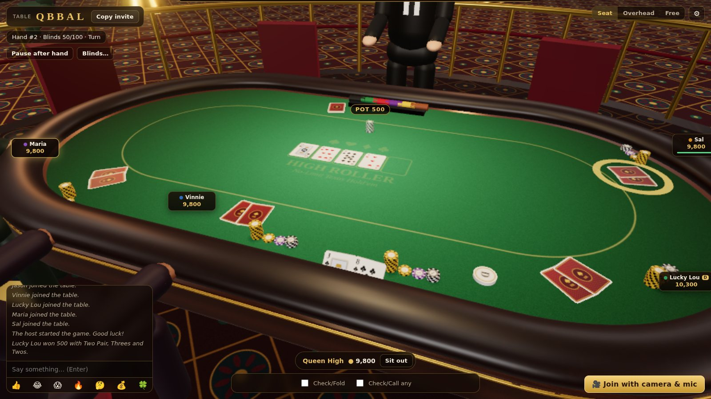
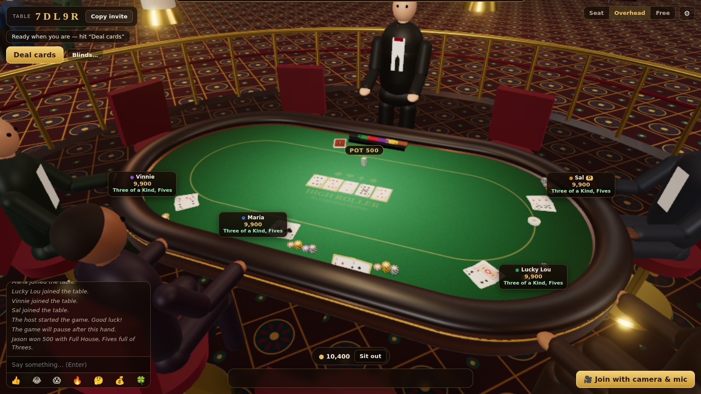
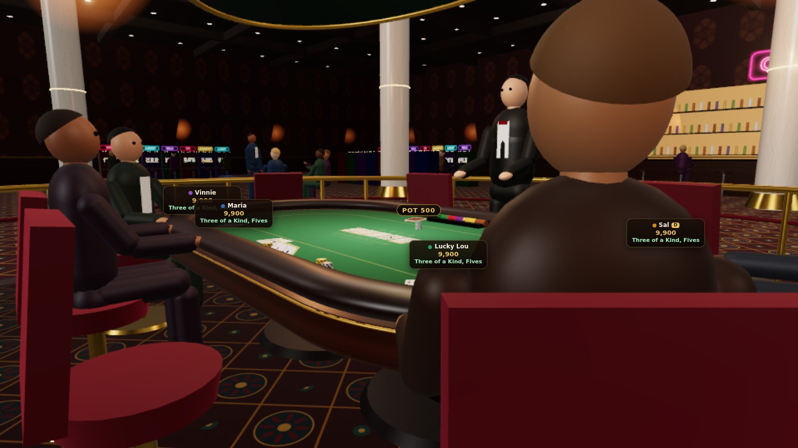

# ♠ High Roller Hold'em

[](LICENSE)
[](https://guinnessstache.github.io/vegas-poker/)

**[Project website](https://guinnessstache.github.io/vegas-poker/)** · [Quick start](#run-it-on-your-pc) · [Deploy](#let-friends-join)



A 3D multiplayer **No-Limit Texas Hold'em** game that runs in the browser. You sit at a padded-rail table on a raised poker platform in a Vegas-style casino, with slot banks, blackjack and roulette tables, a bar, chandeliers and neon around you. Invite friends with a 5-letter table code. Everyone can turn on a **webcam and mic**, and your face shows up over your seat at the table.

The seated first-person view, the dealer and the casino floor take their cue from *High Stakes on the Vegas Strip: Poker Edition* (PS3). All art is generated in code: no textures, models or sound files, and no trademarked names.

| Showdown | Casino floor |
|---|---|
|  |  |

## Features

- **Rooms with codes.** The host creates a table and gets a code like `K7QXP`. Friends type the code or open the invite link (`/?room=K7QXP`). Up to 8 players sit; anyone else watches as a spectator.
- **Full NL Hold'em rules, enforced by the server.** Blinds (heads-up rules included), min-raise, incomplete all-in raises, side pots, split pots with odd chips, uncalled-bet refunds, and a run-out when players are all-in. Hole cards are only ever sent to their owner.
- **3D table.** Cards fly from the dealer and flip over, chips move between stacks, bets and the pot, and the winning 5 cards light up. Players lean back when they fold and cheer when they win. The camera has seated, overhead and free-orbit views.
- **Webcam + mic.** Peer-to-peer WebRTC video appears as a gold-framed portrait over each player's seat. A green ring shows who is talking. You can also turn on regular video tiles.
- **Table talk.** Chat, emoji reactions that float over your seat, and synthesized sound effects plus casino background noise (all Web Audio).
- **Quality of life.** Turn timer (players who time out get sat out), Check/Fold and Call-any pre-actions, bet presets (½ pot, ¾ pot, pot, all-in), a "your hand" hint, rebuy/top-up, sit out, host blind changes, reconnect on refresh, and automatic resolution scaling on slower GPUs.
- **Keyboard:** `F` fold · `C` check/call · `R` raise · `V` change camera · `Enter` chat.

## Run it on your PC

Needs Node.js 18+ (`node -v`).

```bash
npm install
npm start
```

Open http://localhost:3000, enter a name and click **Create table**.

Want to test alone? Open a second browser tab. Each tab counts as a separate player.

## Let friends join

Browsers only allow camera/mic on **HTTPS** pages (or `localhost`), so friends need an HTTPS link. There are two ways to get one.

### Option A: tunnel from your PC (free, instant)

With the server running, open a second terminal:

```bash
# Windows:  winget install --id Cloudflare.cloudflared
# macOS:    brew install cloudflared
cloudflared tunnel --url http://localhost:3000
```

It prints a link like `https://random-words.trycloudflare.com`. Open that link yourself, create a table and click **Copy invite**. The invite link includes the code. `ngrok http 3000` also works.

### Option B: deploy it (always on)

It's a plain Node app, and any host that supports WebSockets works.

- **Render:** [](https://render.com/deploy?repo=https://github.com/Guinnessstache/vegas-poker) (uses the included `render.yaml`). Free instances sleep when idle, so the first load can take about 30 seconds.
- **Railway / Fly.io / any Docker host:** a `Dockerfile` is included. The app listens on `$PORT` (default 3000).

Everything runs in one process with no database, and rooms live in memory. A restart or redeploy clears open tables.

## If someone can't be seen or heard

Video and audio go straight between players over WebRTC. The free Google STUN servers handle most home networks. Some mobile and corporate networks need a **TURN** relay. Set these environment variables and the server passes them to browsers:

```
TURN_URL=turn:your-turn-host:3478,turns:your-turn-host:5349
TURN_USERNAME=...
TURN_CREDENTIAL=...
```

Cloudflare Calls and Metered.ca both offer free TURN tiers, or you can run your own with coturn.

Each player sends their video to every other player (mesh), so a full 8-player table with all cameras on is heavy for weak upload connections. Video is capped at 480×360 to help.

## Project layout

```
server/
  index.js      Express + Socket.IO: static files, /api/ice, socket events
  rooms.js      Table codes, seating, host controls, timers, pacing, chat, WebRTC signaling
  poker.js      Authoritative NL Hold'em engine (pure logic, unit-tested)
  handEval.js   7-card hand evaluator (shared with the browser for the hand hint)
public/
  index.html, css/style.css
  js/main.js    Lobby, HUD, socket wiring
  js/game.js    Turns server state/events into 3D animation
  js/media.js   WebRTC mesh (perfect-negotiation pattern)
  js/sound.js   Synthesized SFX + ambience
  js/scene/     Three.js world: casino, table, cards, chips, avatars, textures, tweens
test/poker.test.js
docs/           Project website (GitHub Pages). `npm run docs:sync` refreshes its copy of the 3D scene modules.
```

`npm test` runs the engine tests: hand rankings, blinds, min-raise, incomplete raises, side pots, split pots, plus a 200-game random stress test that checks no chips are created or lost.

## Tweaking

- Starting chips, blinds, turn timer and rebuys are set when the table is created. The host can change blinds from the HUD (**Blinds…**).
- Change seat count, table size or camera positions in `public/js/scene/table.js` and `public/js/game.js`.
- The felt color is set in `feltTexture()` in `public/js/scene/textures.js`.
- Graphics quality (High / Medium / Low) is under the ⚙ menu.

Play money only. There is no real-money gambling.
