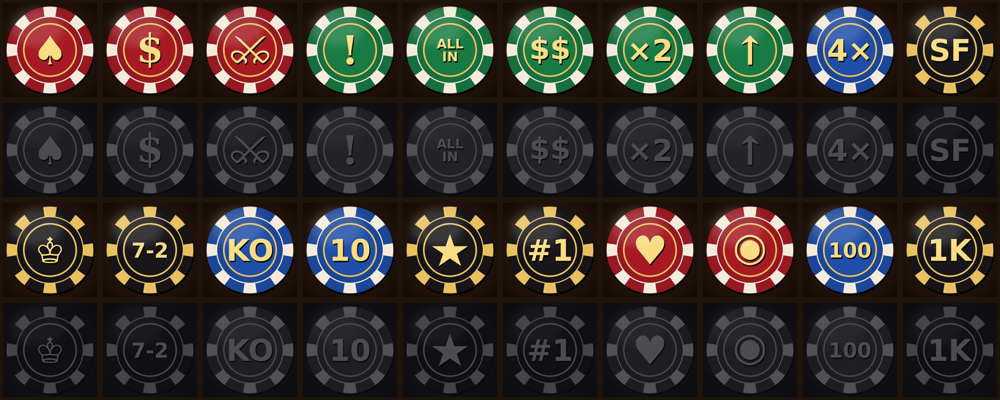

# Steam achievements

Enter these in **Steamworks → your app → Edit Steamworks Settings → Stats & Achievements → Achievements**,
then **Publish** (Steamworks changes don't go live until published).

For each row: *New Achievement* → API Name, Display Name, Description, and upload the two icons from
`steam/achievements/` (achieved = `NAME.jpg`, unachieved = `NAME_locked.jpg`, 64×64).
Leave "Hidden" off and "Set by" = Client. No Steam stats are needed: running totals are kept by the game.

The API Name must match exactly; the game unlocks achievements by these names
(list lives in `public/js/achievements.js`; regenerate this file with `node tools/achievements-sheet.mjs`,
icons with `python tools/make-achievement-icons.py`).

| # | API Name | Display Name | Description | Icons |
|---|---|---|---|---|
| 1 | `FIRST_HAND` | Pull Up a Chair | Play your first hand. | `FIRST_HAND.jpg` / `FIRST_HAND_locked.jpg` |
| 2 | `FIRST_WIN` | Winner Winner | Win your first pot. | `FIRST_WIN.jpg` / `FIRST_WIN_locked.jpg` |
| 3 | `SHOWDOWN_WIN` | Show Me What You Got | Win a pot at showdown. | `SHOWDOWN_WIN.jpg` / `SHOWDOWN_WIN_locked.jpg` |
| 4 | `NERVES_OF_STEEL` | Nerves of Steel | Bet or raise on the river and make everyone fold. | `NERVES_OF_STEEL.jpg` / `NERVES_OF_STEEL_locked.jpg` |
| 5 | `ALL_IN_WIN` | All the Chips | Win an all-in showdown. | `ALL_IN_WIN.jpg` / `ALL_IN_WIN_locked.jpg` |
| 6 | `BIG_POT` | High Roller | Win a pot worth 100 big blinds or more. | `BIG_POT.jpg` / `BIG_POT_locked.jpg` |
| 7 | `DOUBLE_UP` | Double Up | Double your starting stack. | `DOUBLE_UP.jpg` / `DOUBLE_UP_locked.jpg` |
| 8 | `COMEBACK` | Comeback Kid | Get back to your starting stack after dropping below 5 big blinds. | `COMEBACK.jpg` / `COMEBACK_locked.jpg` |
| 9 | `QUADS` | Four of a Kind | Win a hand with four of a kind. | `QUADS.jpg` / `QUADS_locked.jpg` |
| 10 | `STRAIGHT_FLUSH` | Straight to the Top | Win a hand with a straight flush. | `STRAIGHT_FLUSH.jpg` / `STRAIGHT_FLUSH_locked.jpg` |
| 11 | `ROYAL_FLUSH` | Royalty | Win a hand with a royal flush. | `ROYAL_FLUSH.jpg` / `ROYAL_FLUSH_locked.jpg` |
| 12 | `THE_HAMMER` | The Hammer | Win at showdown holding 7-2 offsuit, the worst starting hand. | `THE_HAMMER.jpg` / `THE_HAMMER_locked.jpg` |
| 13 | `KNOCKOUT` | Knockout | Knock a player out of their chips. | `KNOCKOUT.jpg` / `KNOCKOUT_locked.jpg` |
| 14 | `KNOCKOUT_10` | Table Captain | Knock out 10 players. | `KNOCKOUT_10.jpg` / `KNOCKOUT_10_locked.jpg` |
| 15 | `SHARK_HUNTER` | Shark Hunter | Knock out a Hard bot. | `SHARK_HUNTER.jpg` / `SHARK_HUNTER_locked.jpg` |
| 16 | `LAST_ONE_STANDING` | Last One Standing | Be the last player with chips at a table that started with 4 or more. | `LAST_ONE_STANDING.jpg` / `LAST_ONE_STANDING_locked.jpg` |
| 17 | `FRIENDLY_GAME` | Friendly Game | Play a hand with a friend at the table. | `FRIENDLY_GAME.jpg` / `FRIENDLY_GAME_locked.jpg` |
| 18 | `SAY_CHEESE` | Say Cheese | Sit at the table with your camera on. | `SAY_CHEESE.jpg` / `SAY_CHEESE_locked.jpg` |
| 19 | `HANDS_100` | Regular | Play 100 hands. | `HANDS_100.jpg` / `HANDS_100_locked.jpg` |
| 20 | `HANDS_1000` | Card Shark | Play 1,000 hands. | `HANDS_1000.jpg` / `HANDS_1000_locked.jpg` |

